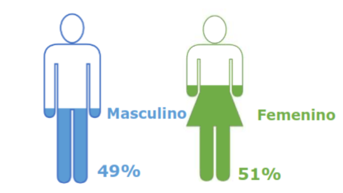
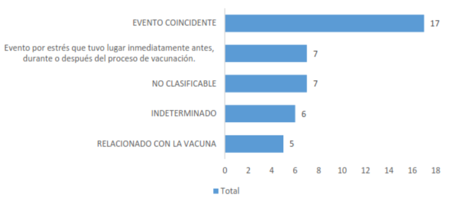
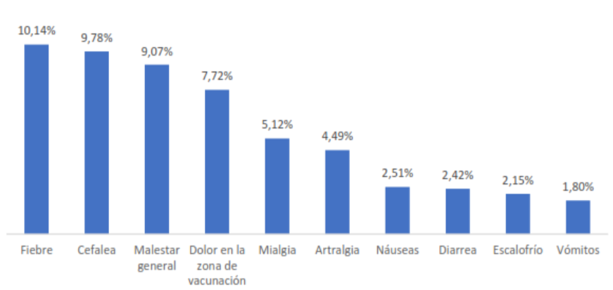

```{r}
#| label: carga_librerias

pacman::p_load(tidyverse,sf,leaflet,flextable,lubridate,colorspace,RPostgreSQL, sqldf, scales, stringi, janitor, kableExtra)

```

```{r}
#| label: conf-formato
options(scipen=999)
form_dec<-scales::label_comma(accuracy = .2, big.mark = "", decimal.mark = ",")
form_mil<-scales::label_comma(big.mark = " ")
```

```{r}
#| label: conexion_db

library(DBI)
library(RJDBC)

dsn_database <- "integraESAVI"
dsn_hostname <- "localhost"
dsn_port <- 5432
dsn_uid <- "usr_dhis2esavi"
dsn_pwd <- "aaaDHIS2"


drv <- JDBC("org.postgresql.Driver","C:/Program Files/PostgreSQL/postgresql-42.3.9.jar")

#drv <- JDBC("org.postgresql.Driver","/JDBC/postgresql-42.6.0.jar")

con <- dbConnect(drv, url="jdbc:postgresql://localhost:5432/integraESAVI", user="usr_dhis2esavi", password="aaaDHIS2")

consulta  <- dbGetQuery(con, 'SELECT COUNT(*) FROM dhi_esavi."TR_PACIENTE"')


```

# Antecedentes

El 31 de diciembre de 2019 se identificaron los primeros casos de neumonía de origen desconocido en China, y el 7 de enero de 2020 se conoció por primera vez un nuevo coronavirus SARS-CoV-2 en humanos [@SAGE_marco]. El primer caso de esta enfermedad en Ecuador fue reportado el 29 de febrero de 2020 [@caso1covid].

El 21 de enero de 2021 inició el proceso de vacunación en el Ecuador. Al momento, en el Ecuador se aplican las vacunas Pfizer/BioNTech, AstraZeneca, Sinovac y la vacuna Cansino. Todas las vacunas fueron aprobadas por la \ac{arcsa} [@caso1covid].

En la @tbl-resumen_vac_reg se evidencia la tasa de reporte de ESAVI NO GRAVE Y ESAVI GRAVE en la Región de las Américas, las cuales son reportadas a la Organización Mundial de la Salud.

```{r}
#| label: tbl-resumen_vac_reg
#| tbl-cap: Tasa de reporte de ESAVI no grave y grave en la Región de las Américas


library(kableExtra)
Datos <- c(6.81,0.14,36.82,1.68, 122.8, 3.4,36.15,11.39,0.07,0.58,29.19,1.71,46.2,2.6,NA,NA) 
Datos<- form_dec(Datos)
Tab1<- data.frame(matrix(Datos,2,8))
colnames(Tab1)<- c("G_Ec","NG_Ec","G_Ch","NG_Ch", "G_C","NG_C","G_Cd","NG_Cd")
Tab1$Vacunas<- c("Pfizer","Sinovac")
Tab1<- Tab1 %>% select(9,1:8) 

kable(Tab1, booktabs = TRUE) %>% 
  add_header_above(c(" "=1,"Ecuador" = 2, "Chile" = 2, "Colombia" = 2, "Canadá" = 2)) %>% kable_styling(latex_options = "HOLD_position")

```

# Desarrollo

```{r}
#| label: conusltas
dosis <- paste("SELECT v. \"NOMBREVACUNA\", \"NUMERODOSIS\", sum(\"CANTIDAD\") \"TOTAL\"
FROM  dhi_esavi.\"TR_VACUNOMETRO\" v 
group by \"NOMBREVACUNA\", v.\"NUMERODOSIS\"
order by 1, 2;")

consulta1 <- dbGetQuery(con, dosis)

```

```{r}
#| label: vacunas
num_vacunas<- consulta1
num_vacunas$TOTAL<- as.numeric(num_vacunas$TOTAL)

Dosis_vac<- num_vacunas |> 
  pivot_wider(names_from = NUMERODOSIS, values_from = TOTAL)

Dosis_vac$NOMBREVACUNA<- stri_extract_last_words(Dosis_vac$NOMBREVACUNA)

totalvac<- sum(Dosis_vac[2:4],na.rm=T) 
tdosis<- colSums(Dosis_vac[2:4],na.rm=T)

vacunas<- num_vacunas  |> 
  group_by(NOMBREVACUNA) |> 
  summarise(CANT_VAC=sum(TOTAL)) |> 
  mutate(percent= round(prop.table(CANT_VAC)*100,2))
vacunas$NOMBREVACUNA<- stri_extract_last_words(vacunas$NOMBREVACUNA)
vacunas<- as.data.frame(vacunas)

Tab2<- Dosis_vac |>
  adorn_totals(c("row","col")) |> 
  adorn_percentages(denominator = "col") |> 
  adorn_pct_formatting() |> 
  adorn_ns(position = "front") 
  
```

Entre el 21 enero de 2021 al 14 de noviembre del 2023, se han inoculado un total de `r form_mil(totalvac)` dosis, de las cuales,primeras dosis corresponden a `r form_mil(tdosis[1])`, segundas dosis corresponde a `r form_mil(tdosis[2])`, primer refuerzo corresponde a `r form_mil(tdosis[3])` dosis, segundo refuerzo corresponde a `r form_mil(tdosis[4])`.

```{r}
#| label: tbl-dosis_vac_reg
#| tbl-cap:  Número de dosis inoculadas 

Tab2 |> 
  kbl(col.names = c("Vacuna","Dosis 1","Dosis 2","Refuerzo 1","Refuerzo 2", "Total")) |> 
  row_spec(0,bold = TRUE) |> 
  row_spec(5, bold = TRUE) |> 
  column_spec(1,width = "2.5cm") |> 
  footnote(general = c("\\\\footnotesize{Fuente: Vacunómetro }","\\\\footnotesize{Elaborado por: DNVE-DNI}"),general_title = "",escape = F)|> 
  kable_styling(latex_options = "HOLD_position") 
  

```

Por el tipo de biológico, con corte al `r format(today(), "%d-%b-%Y")`, el `r vacunas[4,3]`% de dosis administradas corresponde a la vacuna `r vacunas[4,1]`, con un total 
`r form_mil(vacunas[4,2])` de dosis inoculadas, el `r vacunas[1,3]`% de dosis corresponde a la vacuna `r vacunas[1,1]` con un total de `r form_mil(vacunas[1,2])` de dosis inoculadas.

```{r}
#| label: fig-vacunas
#| fig-cap: "Porcentaje de vacunas inoculadas por tipo"


ggplot(vacunas, aes(x = "", y = percent, fill = NOMBREVACUNA)) +
  geom_col(color="gray") +
  geom_label(aes(label = percent), color = c("white","white","white","white"),
            position = position_stack(vjust = 0.5),
            show.legend = FALSE) +
  guides(fill = guide_legend(title = "Vacunas inoculadas")) +
  scale_fill_manual(values = c("#fab96b","#ea777b", "#d6d644","#69a2a8"))+
  coord_polar(theta = "y") + 
  theme_void()

```


En la siguiente [Figura @fig-vacunas] se muestran los porcentajes del tipo de vacunas inoculadas hasta el corte del presente informe.


```{r}
#| label: ESAVI_casos
#| eval: false

cons_esavi<- "select to_char(tn.\"FECHAREPORTENACIONAL\", 'yyyy') Año, to_char(tn.\"FECHAREPORTENACIONAL\", 'TMMonth') Mes, tg.\"TIPOGRAVEDAD\", count(*) 
from dhi_esavi.\"TR_PACIENTE\" tp inner join 
	 dhi_esavi.\"TR_NOTIFICACION\" tn on tp.\"PACIENTE_ID\" = tn.\"PACIENTE_ID\"  inner join  
	 dhi_esavi.\"TR_GRAVEDADESAVI\" tg on tn.\"NOTIFICACION_ID\" = tg.\"NOTIFICACION_ID\" 
group by to_char(tn.\"FECHAREPORTENACIONAL\", 'yyyy'), to_char(tn.\"FECHAREPORTENACIONAL\", 'MM'), to_char(tn.\"FECHAREPORTENACIONAL\", 'TMMonth'),  tg.\"TIPOGRAVEDAD\"
order by to_char(tn.\"FECHAREPORTENACIONAL\", 'yyyy') , to_char(tn.\"FECHAREPORTENACIONAL\", 'MM')"

casos_esavi<-dbGetQuery(con,cons_esavi)
casos_esavi_c<-  casos_esavi

casos_esavi_c$count<- as.numeric(casos_esavi_c$count)


```


# Distribución geográfica de los casos reportados

En el Ecuador desde el inicio de la vacunación hasta el `r format(today(), "%d-%b-%Y")`, se han reportado 98 ESAVI GRAVE. La provincia de Pichincha reporto 41 casos, la provincia de Santo Domingo De Los Tsáchilas reporto 12 casos, la provincia de Manabí reportó 8 casos, la provincia de Azuay reportó 7 casos, la provincia de Tungurahua reportó 6 casos, la provincia del Oro reporto 5 casos, la provincia de Bolívar reporto 3 casos, la provincia de Esmeraldas reporto 3 casos, la provincia de Guayas reporto 3 casos, la provincia de los Ríos reportó 3 casos, la provincia de Chimborazo reportó 2 casos, la provincia de Sucumbíos reportó 2 casos, la provincia de Imbabura reportó 1 caso, la provincia de Loja reporto1 caso y la provincia de Napo reporto 1 caso.

```{r}
#| label: prep_datos_esp

provincias_sf <- st_read("cartografia/ECU_PRV_GEO_20210923.shp",quiet= TRUE )
st_crs(provincias_sf) <- 4326

casos <- read.csv("casos_esavi.csv", sep = ",") 

casos_prov <- left_join(provincias_sf,casos, by= "DPA_DESPRO") %>% select(2,3,5,6)

```

En la [@fig-maprov] se muestra el mapa con el número de casos

En el Ecuador desde el inicio de la vacunación hasta el 25 de julio del 2022, se han reportado 98 ESAVI GRAVE. La provincia de Pichincha reporto 41 casos, la provincia de Santo Domingo De Los Tsáchilas reporto 12 casos, la provincia de Manabí reportó 8 casos, la provincia de Azuay reportó 7 casos, la provincia de Tungurahua reportó 6 casos, la provincia del Oro reporto 5 casos, la provincia de Bolívar reporto 3 casos, la provincia de Esmeraldas reporto 3 casos, la provincia de Guayas reporto 3 casos, la provincia de los Ríos reportó 3 casos, la provincia de Chimborazo reportó 2 casos, la provincia de Sucumbíos reportó 2 casos, la provincia de Imbabura reportó 1 caso, la provincia de Loja reporto1 caso y la provincia de Napo reporto 1 caso.

En la [@fig-maprov] se muestra el mapa con el número de casos

```{r}
#| label: fig-maprov
#| fig-cap: "Número total de casos por provincia"

ggplot(data = casos_prov) + geom_sf(aes(fill = casos) , lwd = 0.1) + scale_fill_continuous_sequential(palette = "Blues", rev = TRUE) + labs(x = "", y = "")+
  theme_classic()
```

# Resumen Ejecutivo

Se han reportado un total de casos ESAVI graves y no graves, en un total de  de dosis inoculadas.
Se han reportado, 98 casos de ESAVI GRAVE en un total de las 36'525.038 de dosis inoculadas, una tasa de reporte de 0.26 casos por 100.000 dosis inoculadas. La tasa de reporte de ESAVI GRAVE para el sexo masculino corresponde a 0.14 casos por 100.000 dosis inoculadas. La tasa de reporte de ESAVI GRAVE para el sexo femenino corresponde a 0.14 casos por 100.000 dosis inoculadas. La tasa de reporte de ESAVI GRAVE para la vacuna Pfizer es 0.14 casos por 100.000 dosis inoculadas, para la vacuna Sinovac corresponde a 0.07 casos por 100.000 dosis inoculadas, para la vacuna AstraZeneca corresponde a 0.07 casos por 100.000 dosis inoculadas, para la vacuna Cansino corresponde a 0.003 casos por 100.000 dosis inoculadas y no reporta la vacuna que corresponde a 0.01 casos por 100.000 dosis inoculadas. En relación con la distribución de notificaciones de ESAVI GRAVE por grupo poblacional, el grupo poblacional con más reporte de ESAVI GRAVE es el grupo poblacional comprendido entre los 25 hasta los 49 años, con una tasa de ESAVI GRAVE de 0.12 casos por 100.000 dosis inoculadas. La provincia de Pichincha reporta el mayor número de ESAVI GRAVES con un total de 41 casos reportados.

Los ESAVI GRAVES, son notificados y dados seguimiento por vigilancia, a partir de lo cual la comisión nacional de ESAVI determinará la relación causal y notificará si corresponde a un ESAVI GRAVE. Al momento se ha realizado el análisis de causalidad de 42 casos que corresponde al 42,85%.

# Distribución ESAVI GRAVE por sexo

```{r}
#| eval: false
esavi_sexo<- "select to_char(tn.\"FECHAREPORTENACIONAL\", 'yyyy') Año, to_char(tn.\"FECHAREPORTENACIONAL\", 'TMMonth') Mes, tc.\"DESCRIPCIONHOMOLOGADA\", count(*) 
from dhi_esavi.\"TR_PACIENTE\" tp inner join 
	 dhi_esavi.\"TR_NOTIFICACION\" tn on tp.\"PACIENTE_ID\" = tn.\"PACIENTE_ID\"  inner join 
	 dhi_esavi.\"TC_CATALOGO\" tc on tp.\"CTSEXO_ID\" = tc.\"CATALOGO_ID\" 
group by to_char(tn.\"FECHAREPORTENACIONAL\", 'yyyy'), to_char(tn.\"FECHAREPORTENACIONAL\", 'MM'), to_char(tn.\"FECHAREPORTENACIONAL\", 'TMMonth'), tc.\"DESCRIPCIONHOMOLOGADA\"
order by to_char(tn.\"FECHAREPORTENACIONAL\", 'yyyy'), to_char(tn.\"FECHAREPORTENACIONAL\", 'MM')"

tb_esavi_sex<-dbGetQuery(con,esavi_sexo)


```


En el periodo desde el 21 de enero del 2021 al 23 de marzo de 2023. Los ESAVI GRAVES según el sexo, al sexo masculino le corresponde el 49% (48 casos) con una tasa de reporte de 0.14 casos por 100.000 dosis inoculadas, al sexo femenino le corresponde el 51 % (50 casos) con una tasa de reporte de 0,14 casos por 100.000 dosis inoculadas.

{#fig-graf2}

# Distribución ESAVI GRAVE por tipo de vacuna.

En el periodo desde el 21 enero del 2021 al 25 de julio del 2022. La vacuna con mayor número de ESAVI GRAVES corresponde a la vacuna Pfizer con el 50% (49 casos) (tasa de reporte de 0.14 casos por 100.000 dosis inoculadas), la vacuna AstraZeneca con el 24% (23 casos) (tasa de reporte de 0.07 casos por 100.000 dosis inoculadas), la vacuna Sinovac con el 23% (23 casos) (tasa de reporte de 0.07 casos por 100.000 dosis inoculadas), la vacuna Cansino con el 1 % (1 caso) (tasa de reporte de 0.003 casos por 100.000 dosis inoculadas) y 2 casos no reporta la vacuna que representa el 2 % (tasa de reporte de 0.01 casos por 100.000 dosis inoculadas).

```{r}
#| label: datos3
Datos3 <- c("0.14 casos por 100.000 dosis inoculadas", "0.07 casos por 100.000 dosis inoculadas") 
Tab3<- data.frame(matrix(Datos3,2,1,byrow=T))
colnames(Tab3)<- "Tasa"
Tab3$Vacuna<- c("Pfizer","Sinovac")
Tab3<- Tab3 %>% select(2,1)

```

```{r}
#| label: tbl-esavig_vac
#| tbl-cap:  Tasa de ESAVI grave por tipo de vacuna

kable(Tab3, format= 'latex', booktabs = TRUE) %>% footnote(general = c("\\\\footnotesize{Fuente: XXX}","\\\\footnotesize{Elaborado por: XX}"),general_title = "",escape = F) %>% 
kable_styling(latex_options = "HOLD_position")

```

# Distribución por grupo poblacional

En el periodo desde el 21 enero del 2021 al 25 de julio de 2022. En relación con la distribución de notificaciones de ESAVI GRAVE por grupo poblacional, el grupo poblacional con más reporte de ESAVI GRAVE es el grupo poblacional comprendido entre los 25 hasta los 49 años, con una tasa de ESAVI GRAVE de 0.12 casos por 100.000 dosis inoculadas.

# Distribución por de ESAVI GRAVE por análisis de causalidad.

En el periodo desde el 01 de octubre del 2021 al 25 de julio del 2022, se ha realizado el análisis de causalidad de 42 eventos que corresponde al 42,85% de los casos reportados como ESAVI GRAVE, 5 eventos fueron clasificados por relación causal con la vacuna ninguno terminó en fallecimiento.

{#fig-graf3}

# Signos y síntomas con mayor número de reporte en los ESAVI NO GRAVES.

En el periodo desde el 21 enero del 2021 al 25 de julio de 2022, se ha notificado 3.635 ESAVI NO GRAVES,de los cuales el 67,93% corresponde a la vacuna Pfizer (tasa de reporte de 6.81 casos por 100.000 dosis inoculadas), el 26,17% corresponde a la vacuna AstraZeneca (tasa de reporte de 2.54 casos por 100.000 dosis inoculadas), el 5,71 % corresponde a la vacuna Sinovac (tasa de reporte de 0.58 casos por 100.000 dosis inoculadas).

```{r}
#| label: datos4
Datos4 <- c("6.81 casos por 100.000 dosis inoculadas ", "2.54 casos por 100.000 dosis inoculadas") 
Tab4<- data.frame(matrix(Datos4,2,1,byrow=T))
colnames(Tab4)<- "Tasa"
Tab4$Vacuna<- c("Pfizer","Sinovac")
Tab4<- Tab4 %>% select(2,1)

```

```{r}
#| label: tbl-esaving_vac
#| tbl-cap:  Tasa de ESAVI no grave por tipo de vacuna

kable(Tab4, format= 'latex', booktabs = TRUE) %>% footnote(general = c("\\\\footnotesize{Fuente: XXX}","\\\\footnotesize{Elaborado por: XX}"),general_title = "",escape = F) %>% 
kable_styling(latex_options = "HOLD_position")

```

En el período comprendido del 01 de enero del 2022 al 07 de mayo del 2022, Los signos y síntomas que se presentan en los casos que se reportan como ESAVI NO GRAVE con mayor frecuencia son fiebre, cefalea, malestar general, dolor en el sitio de la punción, mialgia, artralgia, náusea, diarrea, escalofrío, vomito.

{#fig-graf4} 

# Conclusiones

1.  Las tasas reportadas de los ESAVI GRAVES, están dentro lo esperable, son similares en otros países de la región y corresponde al reporte de la región de las Américas. El reporte de los ESAVI está dentro de los parámetros, en otros lugares de las Américas no hay señales de alarma con respecto a la seguridad de las vacunas.

2.  La tasa de reporte de ESAVI GRAVE por tipo de vacuna es similar en los cuatro grupos, encontrándose dentro del rango de la ficha técnica del fabricante.

# Bibliografía
